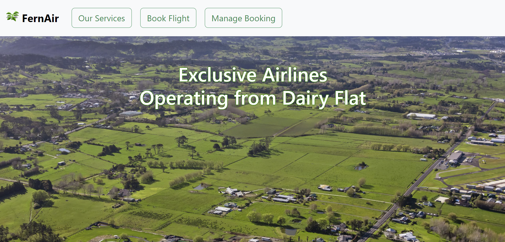
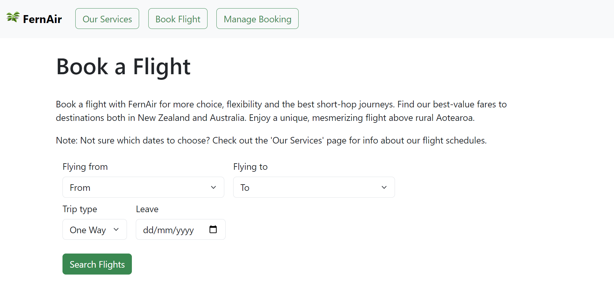
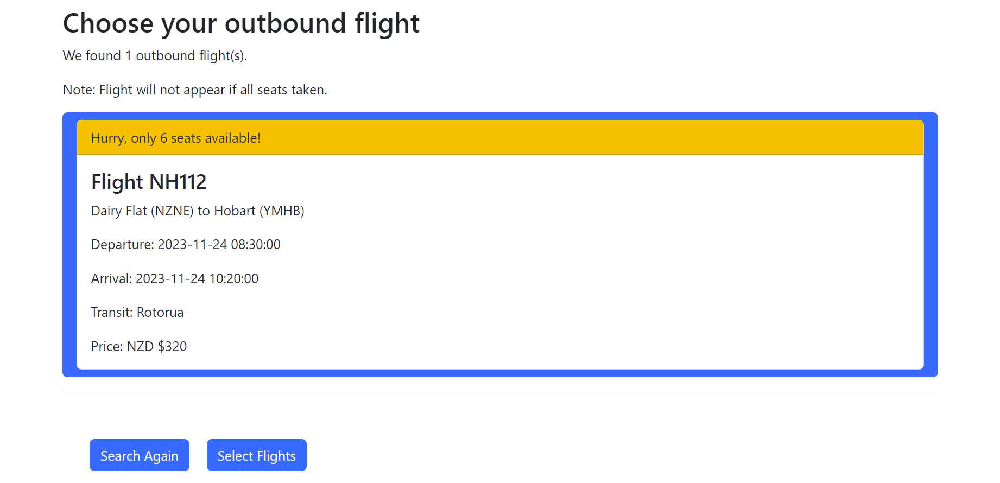
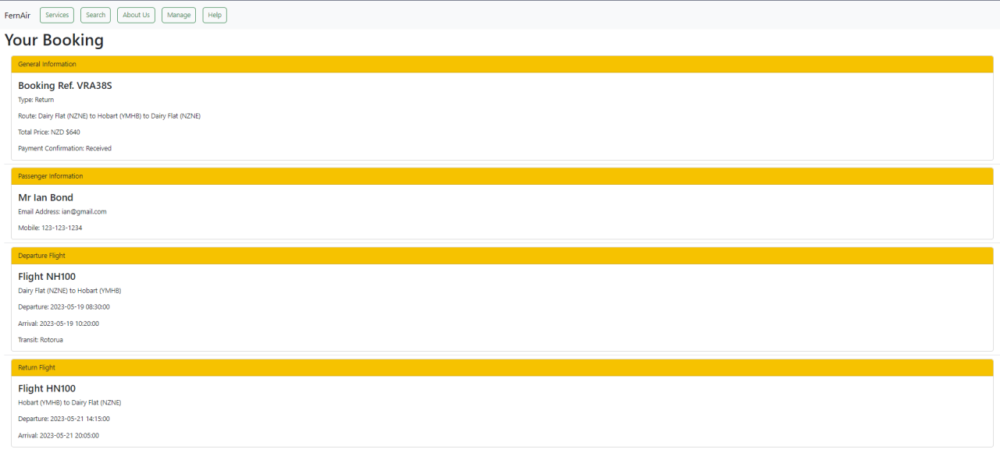

## Assignment 2 - 159352 (Flight Booking System)

Full-stack website with extensive backend functions created using:
- Bootstrap 5 for the frontend.
- Flask (Python) as the web framework.
- SQLite as the database engine.
- Docker for software deployment.
- JetBrains Pycharm for coding.

---

### Massey University Disclaimer

This is a submission for an assignment for the Massey University course 159.352 - Advanced Web Development. Under no circumstances is it to be copied and submitted anywhere as plagiarised work.

---

### Assignment Brief

Design a **Web/Internet application** that implements an *online booking system* for a new airline that operates out of Dairy Flat Airport. 
The airline operates a number of light jet planes, allowing it to provide a highly specialized point-to-point service with Dairy Flat as its hub.  Use any of the tools and frameworks that are being covered in the course. 

Decide on a suitable design for the front and back ends to meet the following
requirements. Your application should...
- feature a landing page that functions as the entry point for your application
- provide a feature to search for flights
- provide a service to allow a user to select a scheduled flight and make a booking
- have the capability for a user to cancel a booking

---

### Screenshots

- Home page

- Booking page

- Choose flights page

- Sample booking

